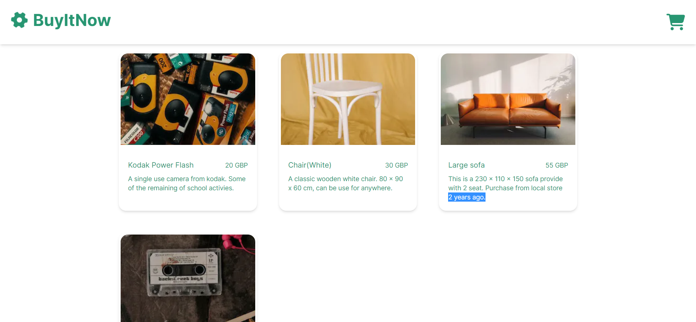

The project is about an e-commerce template to practice the complete workflow using next 13 and stripe.



## Getting Started

First, `npm install` and run the development server:

```bash
npm run dev
# or
yarn dev
# or
pnpm dev
```

Open [http://localhost:3000](http://localhost:3000) with your browser to see the result.

## Deploy on Vercel

The easiest way to deploy the Next.js app is to use the [Vercel Platform](https://vercel.com/new?utm_medium=default-template&filter=next.js&utm_source=create-next-app&utm_campaign=create-next-app-readme) from the creators of Next.js.
